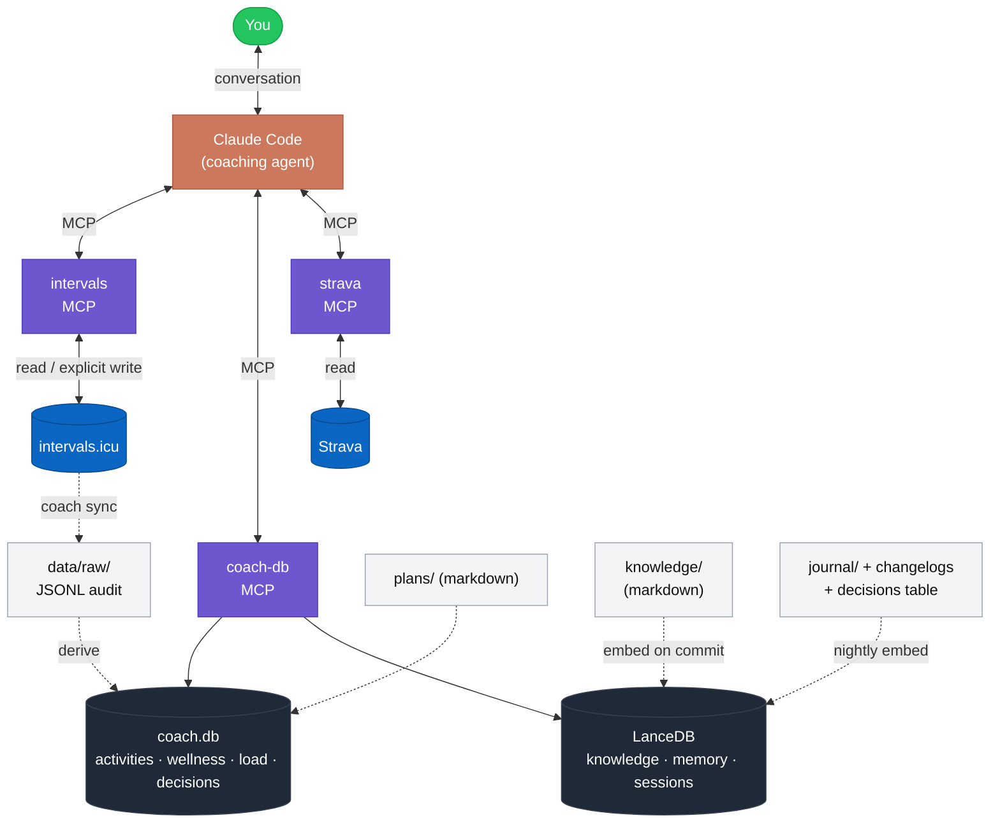

<div align="center">



<p>
  <em>Full-stack endurance coaching — periodization, weekly adjustments, and the reasoning behind each one, in a local-first repo you own.</em>
</p>

<p>
  <a href="https://www.python.org/"></a>
  <a href="https://docs.claude.com/en/docs/claude-code"></a>
  <a href="https://intervals.icu"></a>
  <a href="https://modelcontextprotocol.io"></a>
  <a href="#build-phases"></a>
</p>

</div>

---

Tempo turns [Claude Code](https://docs.claude.com/en/docs/claude-code) into a personal endurance coach for the long game — an Ironman buildup, a marathon peak, a year of base. It sits on top of [intervals.icu](https://intervals.icu) (the source of truth for raw training data) and adds the reasoning layer: periodization methodology, plan artifacts in git, a derived-metrics store for fast queries, and a vector index for coaching knowledge and agent memory.

The problem with intervals.icu alone is that it handles data beautifully but has no reasoning memory — no *"why did we cut volume in March?"*, no curated methodology, no retrievable coaching knowledge. Tempo owns that layer. It does **not** replicate intervals.icu's data model; it sits on top via MCP and adds three things the platform can't: persistent coaching context with rationale, versioned plan artifacts as git-diffable markdown, and a derived-metrics store optimized for fast agent reasoning.

> **Design doc / authoritative spec:** [`take-this-project-and-temporal-tarjan.md`](/home/seanm/.claude/plans/take-this-project-and-temporal-tarjan.md)

---

## What it does

- **Plans periodization end-to-end.** Takes a goal (a race from `athlete/race-calendar.yaml` or a non-race goal from `athlete/goals.yaml`) and drafts a full periodized plan with phase-by-phase structure and rationale.
- **Drafts a week at a time** based on recent adherence, wellness, load, and active injury flags. Plans are git-versioned markdown, so every adjustment is a diff with a changelog entry.
- **Never writes to your calendar autonomously.** Agent drafts → you review diff → `coach push-week` writes.
- **Retrieves trusted coaching knowledge** (Friel, Seiler, Jeukendrup, CTS, peer-reviewed research) via semantic search. Every snippet is tagged with credibility; unvetted sources are flagged at retrieval time.
- **Remembers why.** Persistent decisions table + vector memory make *"why did we cut volume in March?"* answerable six months later.

---

## Architecture

Four substrates, each doing what it's best at. None of them pretends to do another's job.

| Shape | Store | What lives here | Why |
| --- | --- | --- | --- |
| Time-series | **SQLite** `data/coach.db` | activities, wellness, load, adherence, decisions | stable schema, fast aggregation, disposable |
| Narrative | **Markdown + YAML** | plans, weeks, methodology, journals | git-diffable; both queryable (frontmatter) and LLM-friendly (body) |
| Semantic | **LanceDB** `data/vectors/` | knowledge, memory, session library | retrieval is concept-shaped, not field-shaped |
| Audit | **JSONL** `data/raw/` | every API response, gzipped weekly | makes the DB disposable; every derivation traceable |



*You drive every conversation. The agent reads state through typed MCP tools and only writes to intervals.icu when you explicitly run `coach push-week`.*

**MCP servers wired** (see `.claude/settings.json`):

- **`intervals`** — 48 upstream tools + 2 Tempo extensions (`get_week_summary`, `bulk_upsert_tagged_events`). Fork of eddmann/intervals-icu-mcp.
- **`coach-db`** — built here. Typed surface over `coach.db` + LanceDB. Nine tools: `query_activities`, `get_load_curve`, `get_readiness`, `get_adherence`, `compare_plan_to_actual`, `search_knowledge`, `search_memory`, `find_similar_session`, `log_decision`.
- **`strava`** — r-huijts upstream. Segments, streams, anything intervals doesn't expose.

---

## Quickstart

```bash
# 1. Clone with submodules
git clone --recurse-submodules <your-fork-of-this-repo> tempo
cd tempo

# 2. Credentials
cp .env.example .env
# edit .env — API_KEY / ATHLETE_ID from https://intervals.icu/settings

# 3. Submodule deps
cd mcp-servers/intervals-icu-mcp && uv sync && cd ../..

# 4. Athlete profile
$EDITOR athlete/profile.yaml     # FTP, zones, weight, thresholds
$EDITOR athlete/preferences.md   # coaching style, schedule, constraints

# 5. Declare a goal (or a race)
$EDITOR athlete/race-calendar.yaml
# OR
$EDITOR athlete/goals.yaml

# 6. Open Claude Code in this directory
#    .claude/CLAUDE.md loads automatically; intervals + coach-db MCPs are wired.

# Optional — auto-embed knowledge/ changes on commit
bash scripts/install-hooks.sh
```

At this point you can have useful planning conversations with live intervals data. The weekly loop (`coach plan week`, `coach review week`) and the dashboards land in Phase 4–5 — see [build phases](#build-phases).

---

## A day in the life

Once Phase 4 skills land, the rhythm looks like this:

```bash
coach check-in              # morning wellness → intervals + coach.db
# ... train as normal; Garmin → Strava → intervals is automatic ...
coach sync                  # evening: pull activities, derive CTL/ATL/TSB

# Sunday
coach review week           # post-mortem — adherence, trends, lessons
coach plan week --next      # draft next week, grounded in last week's data
# -- you review the diff --
coach push-week 2026-W18    # idempotent write to intervals calendar
```

Deterministic vs agentic:

| Deterministic (pure scripts) | Agentic (Skill-invoked) |
| --- | --- |
| `coach sync` | `coach plan week` |
| `coach status` | `coach review week` |
| `coach push-week <week>` | `coach bootstrap-plan <goal>` |
| `coach vectors rebuild` | `coach research <topic>` |
| `coach check-in` (prompted) | `coach ingest <url>` |

---

## Repository layout

```
tempo/
├── athlete/              who Sean is right now — profile, goals, injuries, prefs
├── knowledge/            coaching corpus — methodology, nutrition, research
│   ├── sources.yaml         trusted-source registry with credibility tags
│   └── methodology/         phases.yaml, session-library.md, decision-rules.md
├── plans/<plan-id>/      plans in flight — yaml + rationale + weeks + changelog
├── journal/              YYYY-MM-DD.md daily notes & decisions
├── data/                 GITIGNORED — coach.db, vectors/, raw/, events.jsonl
├── mcp-servers/
│   ├── intervals-icu-mcp/   submodule — fork with 2 Tempo extensions
│   └── coach-db/            built here — FastMCP wrapper over SQLite + LanceDB
├── src/tempo/            the `coach` CLI package
├── scripts/              deterministic scripts (sync, derive, embed, hooks)
└── .claude/              system prompt, skills, slash commands, MCP settings
```

Gitignored at root: `data/`, `.env`, `*.db`, `*.lance`, `.claude/settings.local.json`.

---

## Build phases

Phases are not calendar-bound. Each is independently useful; you can stop early if it's enough.

| Phase | Scope | Status |
| :---: | --- | :---: |
| **0** | scaffold, intervals MCP wired, athlete + knowledge stubs — conversational planning works | shipped |
| **1** | SQLite schema + `coach sync`/`coach status`; fast local queries | shipped |
| **2** | LanceDB + knowledge corpus + auto-embed on commit | shipped |
| **3** | **`coach-db` MCP** — typed surface: `query_activities`, `get_load_curve`, `get_readiness`, `get_adherence`, `compare_plan_to_actual`, `search_knowledge`, `search_memory`, `find_similar_session`, `log_decision`. Strava wired. | **shipped** |
| **4** | `bootstrap-plan`, `plan-training-week`, `review-week`, `morning-check-in` Skills — full coaching loop | next |
| **5** | Dashboards (week / macro / decisions) as HTML artifacts | planned |
| **6** | `ingest-research`, `draft-race-plan`, nutrition deep-dive | planned |

---

## Design invariants

These are non-negotiable. Every commit is measured against them.

- **Intervals.icu is the source of truth for raw data.** `coach.db` is always rebuildable from `data/raw/` + `plans/`.
- **Writes to intervals are explicit.** Agent drafts; user reviews diff; user runs `coach push-week`. No autonomous calendar mutations.
- **Every plan adjustment produces a changelog entry with rationale** *and* a `log_decision` call. This is the coaching memory.
- **Structured where structure exists, semantic where it doesn't, narrative where neither fits.** SQL for metrics, vectors for recall, markdown for rationale — in that order.
- **Skills are for procedures. Conversation is for judgment.** Don't skill-ify Q&A.
- **Active injury flag overrides everything.** If `athlete/injury-log.md` has an entry in *Active*, it constrains the week before any other consideration.

---

<div align="center">

Built by [Sean Koval](mailto:seanmkoval@gmail.com) with [Claude Code](https://docs.claude.com/en/docs/claude-code).

</div>
